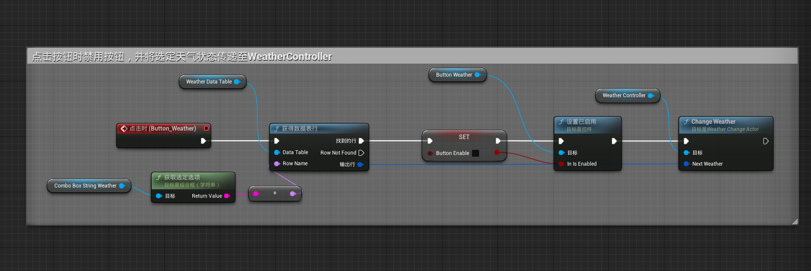
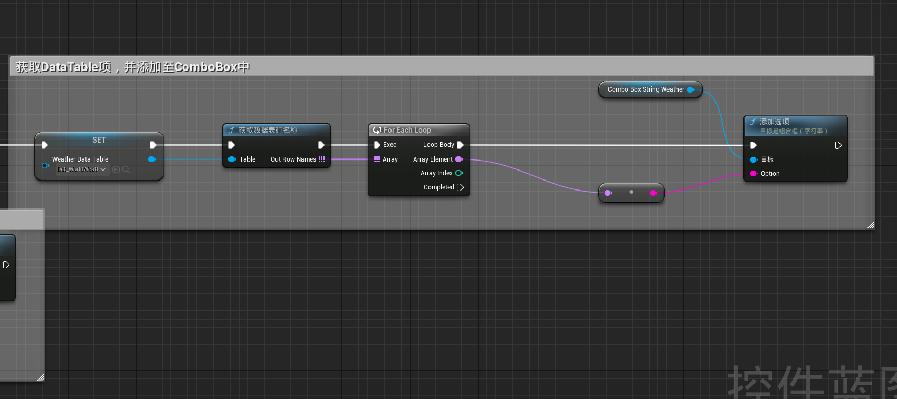
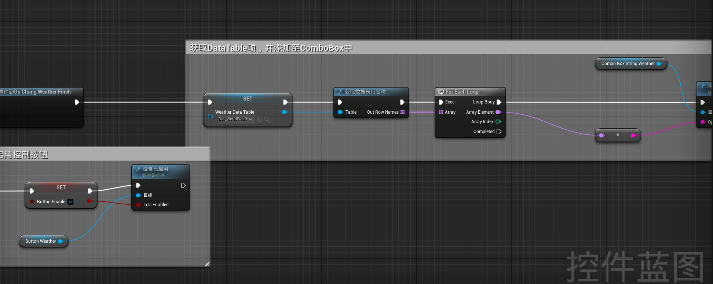

## 雨shader实现

### 雨表面

参考: [UE4 Material 101学习笔记——13-18 完整的雨水着色器](https://blog.csdn.net/weixin_43803133/article/details/112911745)

原理：

基于UE的材质系统，编写材质蓝图，实现材质函数

基于对雨水在各个表面的情况，通过mask与shader的编写，实现了雨水潮湿着色器、表面水珠着色器、流淌雨滴着色器、雨滴涟漪着色器与水坑着色器，并通过材质函数与材质参数集，实现对已有材质的修改，表现出雨天的效果

<!-- more -->
### 镜头与Niagara雨效果

参考:[【UE4】简单的雨滴效果](https://www.bilibili.com/video/BV17r4y1C7B4/?spm_id_from=333.788.recommend_more_video.4)

原理：

通过镜头材质函数，将材质函数应用与后处理体积(PostProcessVolume)上，并使后处理体积作用范围无限，材质函数与材质参数集相关联，用于实现雨天大小的整体控制

通过Niagara粒子发射系统，调整发射的粒子效果，以实现仿真雨的感觉，并将计算置于GPU上，使处理效率更高

## 雪shader实现

参考:

1. [UE4[蓝图]动态积雪材质的实现](https://zhuanlan.zhihu.com/p/51150141) 
2. [UE4[蓝图]动态积雪材质的实现（二）](https://zhuanlan.zhihu.com/p/52509664)
3. [UE4[蓝图]下雪效果及雪的材质的实现](https://zhuanlan.zhihu.com/p/51038902)

原理同上

## 雨、雪的状态控制与动态切换

原理：

在前两个模块中建立的雨雪shader中，引入材质参数集，通过在蓝图与C++中控制材质参数集，以实现场景天气状态更替的效果

在Niagara中定义用户变量，将用户变量与粒子生成相关联，通过控制用户变量，实现控制粒子生成的多少

材质参数集的过渡依赖Timeline时间轴组件，通过时间轴曲线，实现平滑过渡

实现：

1. 基于Actor建立C++类
2. 在雨雪shader中，将控制雨雪大小的参数替换为材质参数集控制的参数
3. 在Niagara中定义用户变量
4. 在build.cs类中引入Niagara相关模块

    ```Csharp
    PublicDependencyModuleNames.AddRange(new string[] { "Core", "CoreUObject", "Engine", "InputCore" ,"UMG" ,"Niagara" , "NiagaraCore"});
    ```

5. 在C++类外定义结构体，以描述天气状态

    ```cpp
    USTRUCT(BlueprintType)
    struct F[结构体名称]
    {
        GENERATED_BODY()
        ...
    };
    ```

6. 在引擎中建立基于该结构体的DataTable。实现天气状态的存储
7. 在类外定义无参动态多播委托，实现蓝图与C++类之间的交互

    ```cpp
    DECLARE_DYNAMIC_MULTICAST_DELEGATE()
    ```

8. 在类内定义时间轴组件，曲线、时间轴、材质参数集、Niagara系统，以关联控制（具体见代码）
9. 完成天气替换过渡与逻辑
10. 编译C++类并生成蓝图类
11. 将蓝图类置于场景中，并指定时间轴曲线，材质参数集

    
    

12. 定义蓝图控制用户界面控件，以控制BP_WeatherChangActor

完整代码:

```cpp
// WeatherChangeActor.h
// Fill out your copyright notice in the Description page of Project Settings.

#pragma once

#include "CoreMinimal.h"
#include "GameFramework/Actor.h"
#include "Engine/DataTable.h"
#include "Components/TimelineComponent.h"
#include "Kismet/KismetMaterialLibrary.h"
#include "Materials/MaterialParameterCollection.h"
#include "Niagara/Public/NiagaraComponent.h"
#include "GameFramework/Character.h"
#include "WeatherChangeActor.generated.h"

/****
 * 天气状态结构体
 ***/
USTRUCT(BlueprintType)
struct FWeatherState : public FTableRowBase
{
	GENERATED_BODY()

public:
	FWeatherState(){}
	FWeatherState(FName _Name,float _Wet,float _SnowAmount):Name(_Name),Wet(_Wet),SnowAmount(_SnowAmount){}
	
	UPROPERTY(EditAnywhere,BlueprintReadWrite,Category="Table")
	FName Name;

	UPROPERTY(EditAnywhere,BlueprintReadWrite,Category="Table")
	float Wet;

	UPROPERTY(EditAnywhere,BlueprintReadWrite,Category="Table")
	float SnowAmount;
};

// 定义无参多播委托，以传递时间轴结束信息
DECLARE_DYNAMIC_MULTICAST_DELEGATE(FOnChangWeatherFinsh);

// 天气变换控制类
UCLASS()
class SCHOOL_API AWeatherChangeActor : public AActor
{
	GENERATED_BODY()
	
public:	
	// Sets default values for this actor's properties
	AWeatherChangeActor();

protected:
	// Called when the game starts or when spawned
	virtual void BeginPlay() override;

public:	
	// Called every frame
	virtual void Tick(float DeltaTime) override;

	// 当前天气状态
	UPROPERTY(EditAnywhere,BlueprintReadWrite,Category="Weather")
	FWeatherState NowWeather;

	// 改变天气函数
	UFUNCTION(BlueprintCallable,Category="Weather Change")
	void ChangeWeather(FWeatherState NextWeather);

	// 时间轴控制曲线
	UPROPERTY(EditAnywhere)
	UCurveFloat* WeatherChangeCurve;

	// Wet 材质参数集
	UPROPERTY(EditAnywhere,BlueprintReadWrite,Category="Material")
	UMaterialParameterCollection* WetMaterialCollection;

	// Snow 材质参数集
	UPROPERTY(EditAnywhere,BlueprintReadWrite,Category="Material")
	UMaterialParameterCollection* SnowMaterialCollection;

	// 天气变换结束委托
	UPROPERTY(BlueprintAssignable)
	FOnChangWeatherFinsh OnChangWeatherFinsh;
	
protected:

	UPROPERTY(VisibleAnywhere,BlueprintReadWrite)
	UTimelineComponent* WeatherChangeTimeline;
	
	// 用于控制天气的轨道
	FOnTimelineFloat UpdateWeatherTrack;
	
	// 用于更新天气的函数
	UFUNCTION()
	void UpdateWeatherState(float WeatherOutput);
	
	// 用户 character
	UPROPERTY()
	ACharacter* UserPawn;

	// 世界指针
	UPROPERTY()
	UWorld* NowWorld;

	UPROPERTY()
	float WetDiff;

	UPROPERTY()
	float SnowDiff;

	// 降雨 Niagara
	UPROPERTY()
	UNiagaraComponent* RainNiagara;

	// 降雨 Niagara
	UPROPERTY()
	UNiagaraComponent* SnowNiagara;

	UPROPERTY(EditAnywhere,BlueprintReadWrite,Category="Niagara Particle")
	float MaxSnowAmount = 10000;

	UPROPERTY(EditAnywhere,BlueprintReadWrite,Category="Niagara Particle")
	float MaxRainAmount = 10000;

	// 天气变换结束回调函数
	UFUNCTION()
	void WeatherTimelineFinishedCallBack();

private:
	UPROPERTY()
	FWeatherState TmpWeather;
	
};

//WeatherChangeActor.cpp
// Fill out your copyright notice in the Description page of Project Settings.


#include "WeatherChangeActor.h"

#include "Kismet/GameplayStatics.h"
#include "Kismet/KismetMaterialLibrary.h"
#include "Materials/MaterialParameterCollection.h"

// Sets default values
AWeatherChangeActor::AWeatherChangeActor()
{
 	// Set this actor to call Tick() every frame.  You can turn this off to improve performance if you don't need it.
	PrimaryActorTick.bCanEverTick = true;

	// 生成时间线组件
	WeatherChangeTimeline = CreateDefaultSubobject<UTimelineComponent>(TEXT("WeatherTimelineComponent"));
}

// Called when the game starts or when spawned
void AWeatherChangeActor::BeginPlay()
{
	Super::BeginPlay();

	// 将浮点轨道与函数绑定
	UpdateWeatherTrack.BindDynamic(this,&AWeatherChangeActor::UpdateWeatherState);

	// 获取当前世界
	NowWorld = GetWorld();

	// 获取用户character
	UserPawn = UGameplayStatics::GetPlayerCharacter(NowWorld,0);

	// 获取Niagara
	TArray<UNiagaraComponent*> WeatherComponents;
	UserPawn->GetComponents(WeatherComponents);

	// 寻找相应的Niagara组件
	if(WeatherComponents.Num() > 0)
	{
		for(auto WeatherComponent : WeatherComponents)
		{
			// GEngine->AddOnScreenDebugMessage(-1,10.0f,FColor::Green,WeatherComponent->GetName());
			if(WeatherComponent->GetName() == TEXT("Ns_Rain"))
			{
				RainNiagara = WeatherComponent;
				// GEngine->AddOnScreenDebugMessage(-1,10.0f,FColor::Green,WeatherComponent->GetName());
			}
			else if(WeatherComponent->GetName() == TEXT("Ns_Snow"))
			{
				SnowNiagara = WeatherComponent;
				// GEngine->AddOnScreenDebugMessage(-1,10.0f,FColor::Green,WeatherComponent->GetName());
			}
		}
	}
	
	// 如果有浮点曲线，将图表与更新函数绑定
	if(WeatherChangeCurve)
	{
		WeatherChangeTimeline->AddInterpFloat(WeatherChangeCurve,UpdateWeatherTrack);

		// 定义回调事件、绑定回调函数
		FOnTimelineEventStatic onTimelineFinishedCallBack;
		onTimelineFinishedCallBack.BindUFunction(this,FName(TEXT("WeatherTimelineFinishedCallBack")));
		WeatherChangeTimeline->SetTimelineFinishedFunc(onTimelineFinishedCallBack);
	}
}

// Called every frame
void AWeatherChangeActor::Tick(float DeltaTime)
{
	Super::Tick(DeltaTime);

}

// 获取当前天气情况值与预期天气情况值
// 做差值计算
// 保留原始值
// set = 原始值 + 差值 * 曲线值
void AWeatherChangeActor::ChangeWeather(FWeatherState NextWeather)
{
	WetDiff = NextWeather.Wet - NowWeather.Wet;
	SnowDiff = NextWeather.SnowAmount - NowWeather.SnowAmount;

	// 将下一个天气存储为临时天气状态，准备替换
	TmpWeather = NextWeather;

	// 从开始播放时间轴
	WeatherChangeTimeline->PlayFromStart();
}

// 更改天气状态Tick事件
void AWeatherChangeActor::UpdateWeatherState(float WeatherOutput)
{
	float SnowAmount = NowWeather.SnowAmount + SnowDiff * WeatherOutput;
	float Wet = NowWeather.Wet + WetDiff * WeatherOutput;
	
	UKismetMaterialLibrary::SetScalarParameterValue(NowWorld,SnowMaterialCollection,FName(TEXT("SnowAmount")),SnowAmount);
	SnowNiagara->SetVariableFloat(FName(TEXT("SnowAmount")),SnowAmount * MaxSnowAmount);
	
	UKismetMaterialLibrary::SetScalarParameterValue(NowWorld,WetMaterialCollection,FName(TEXT("Wetness")),Wet);
	RainNiagara->SetVariableFloat(FName(TEXT("RainFreq")),Wet * MaxRainAmount);

	GEngine->AddOnScreenDebugMessage(-1,1.f,FColor::Cyan,FString::SanitizeFloat(Wet));
	GEngine->AddOnScreenDebugMessage(-1,1.f,FColor::White,FString::SanitizeFloat(SnowAmount));
}

// 回调函数
void AWeatherChangeActor::WeatherTimelineFinishedCallBack()
{
	GEngine->AddOnScreenDebugMessage(-1,10.f,FColor::Orange,TEXT("END OF Timeline"));

	// 将临时天气替换为当前天气
	NowWeather = TmpWeather;

	// 广播结束事件
	OnChangWeatherFinsh.Broadcast();
	// GEngine->AddOnScreenDebugMessage(-1,10.f,FColor::Orange,NowWeather.Name.ToString());
}
```

蓝图:







