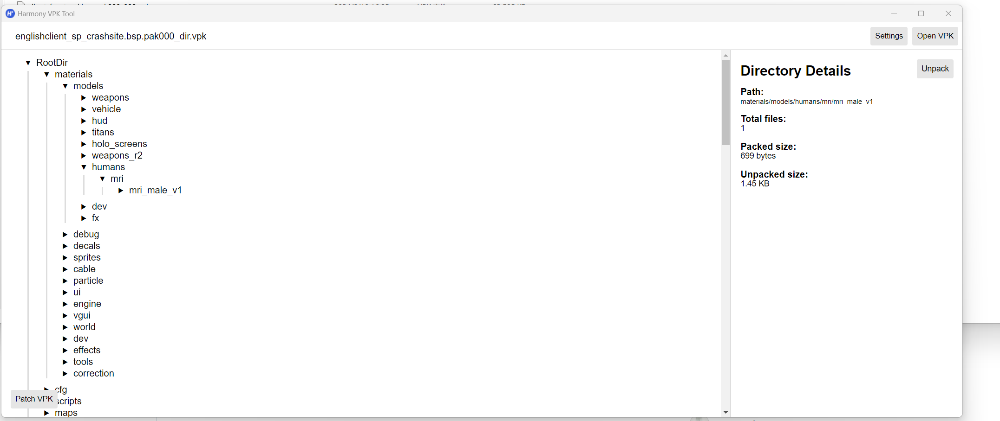
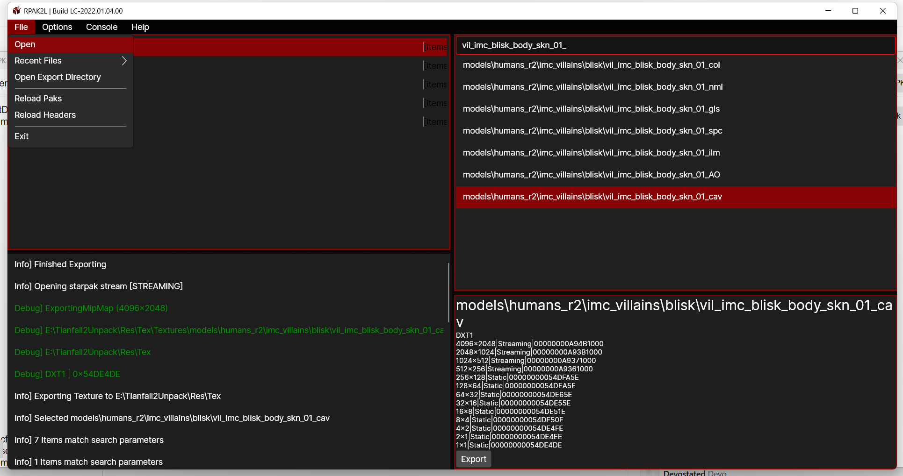
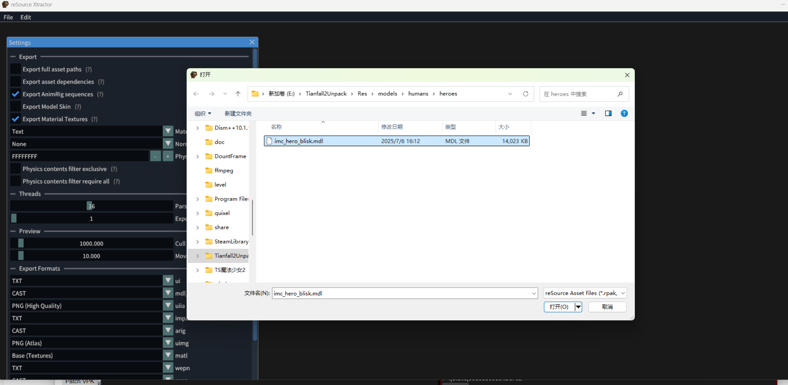
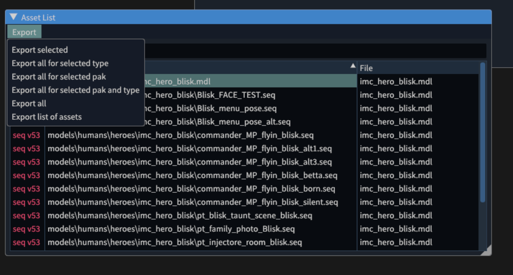

# 泰坦陨落2解包

## require

[基础文档](https://noskill.gitbook.io/titanfall2/intro/duction/tools)

鉴于Apex还在持续更新的情况，选择目前还在维护的工具

1. [HarmonyVPKTool(vpk解包)](https://github.com/harmonytf/HarmonyVPKTool)
2. [RPAK2l(rpak解包)](https://github.com/headassbtw/rpak2l)
3. [rsx(mdl解cast)](https://github.com/r-ex/rsx)
4. [cast(blender导入cast)](https://github.com/dtzxporter/cast)
   
<!-- more -->

## 流程

### 使用HarmonyVPK解包VPK 获取模型、动作

在游戏根目录下找到vpk文件夹，找到形如xxx_dir.vpk的文件，使用工具打开

unpack将指定文件解包至指定目录

### 使用RPAK2l解包rpak获取贴图

在游戏根目录下找到r2/paks/Win64/找到目标rpak，使用工具打开

点击Export将指定文件导出

### 使用 rsx 将HarmonyVPK解包的mdl文件转化为cast文件

使用工具打开解包的mdl文件

导出

### 在blender中显示

在高于blender3.9以上的版本中安装上文中的插件，导入上文中的模型、动作，并在生成的材质中指定导出的贴图（贴图的实际名称可以通过材质的名称获取）

## 结果

